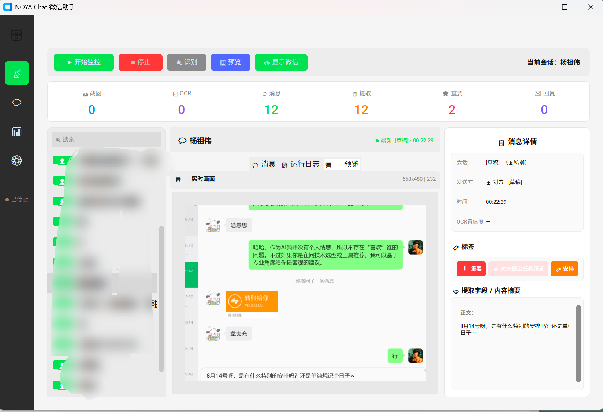
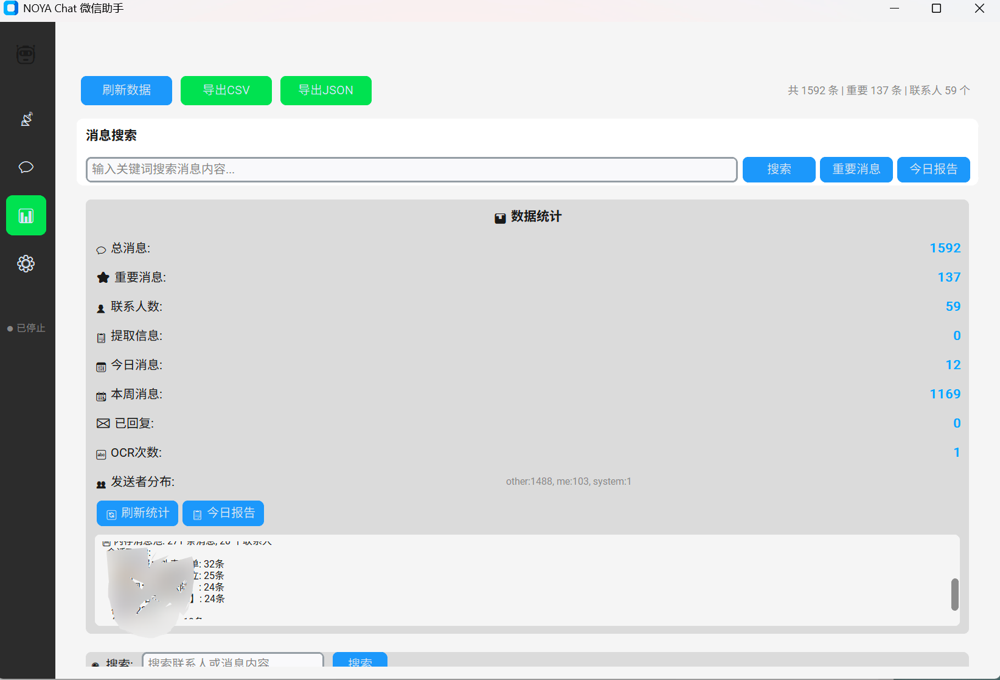
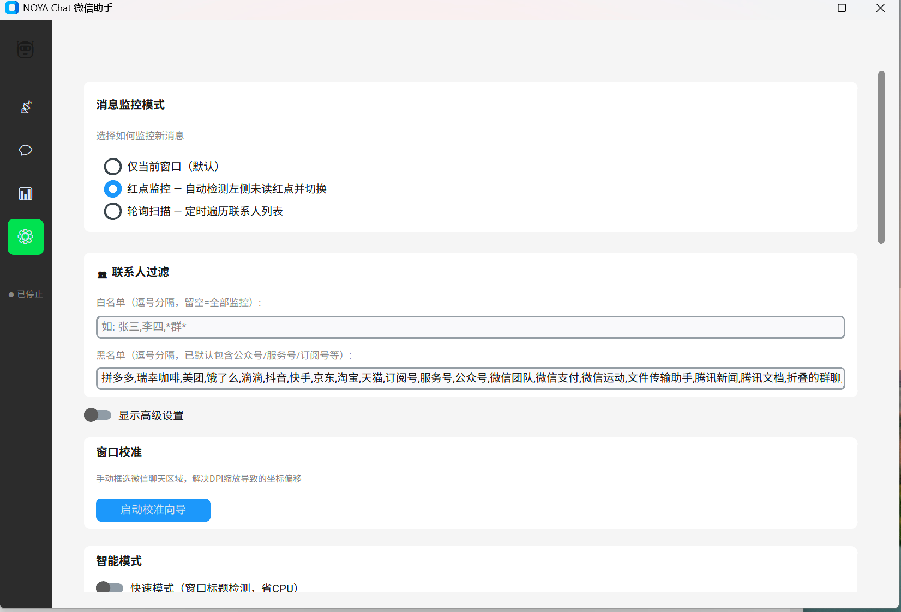

# NOYA Chat 微信助手

> 
> 📱微信消息智能中枢 · OCR截图识别｜AI语义理解｜可控自动回复｜Obsidian知识库沉淀

  
  
  
  
  
  

---

## 📖 项目简介

**NOYA Chat 微信助手** 是一款面向 Windows 的本地微信消息智能管理工具。
基于**窗口截图 + PaddleOCR** 方案实时解析微信聊天会话，接入大模型完成语义解析、信息抽取、智能回复，将全部聊天数据自动归档同步至 Obsidian，打造属于你的个人信息闭环。

> 
> 💡核心理念：**微信作为信息采集入口，Obsidian 作为思考与沉淀出口。**

> 
> ⚠️ 说明：本项目基于屏幕截图OCR实现，**非微信协议逆向**；所有数据本地存储，不经过第三方中转。

---

## ✨ 核心功能
<p align="center">

</p>
<p align="center">

</p>
<p align="center">

</p>

### 🔍 消息监控

| 功能 | 描述 |
| --- | --- |
| 红点自动检测 | 识别微信会话栏未读红点，自动切换会话读取消息后复原原窗口 |
| 双模式识别 | 模板匹配优先 + HSV六特征兜底，适配不同系统DPI、微信主题 |
| 后台无感运行 | 最小化/屏幕外可工作，无频繁弹窗、不抢占窗口焦点 |
| 会话冷却保护 | 60s联系人冷却策略，避免反复切换同一会话造成资源浪费 |

### 👁️ OCR消息解析

| 功能 | 描述 |
| --- | --- |
| 中英混合识别 | PaddleOCR引擎，支持中文、英文、数字、符号 |
| 收发方区分 | 根据气泡位置、配色区分自己/对方消息，识别率90%+ |
| 增量帧检测 | 帧差异比对+pHash去重，画面静止跳过OCR，降低CPU占用 |
| 模糊帧过滤 | Laplacian方差评分，过滤微信动画过渡产生的无效模糊截图 |

### 🤖 AI智能回复

| 功能 | 描述 |
| --- | --- |
| 多角色配置 | 技术顾问 / 商务伙伴 / 好友 / 段子手，支持按联系人独立设定 |
| 默认角色 | 全局默认友好朋友风格，开箱即用 |
| 预览确认模式 | AI生成回复粘贴至微信输入框，**人工确认后发送，规避风险** |
| 安全停止机制 | LLM调用前后双重校验停止标记，停止指令立即终止全部流程 |
| 对话上下文记忆 | 维护最近N轮聊天上下文，保证回复连贯性 |

### 📑 AI信息抽取

| 功能 | 描述 |
| --- | --- |
| 消息自动分类 | 自动标记：工作 / 生活 / 广告 / 验证码 / 通知 / 其他 |
| 消息紧急评级 | 1‑5级紧急度打分，重要消息高亮提醒 |
| 待办事项提取 | 自动识别聊天内任务、截止时间，输出Obsidian Tasks标准格式 |
| 情绪识别 | 识别对方消息情绪：积极 / 中性 / 消极 |
| 自定义规则 | 支持正则表达式，自定义关键词匹配逻辑 |

### 💾 数据存储与查询

| 功能 | 描述 |
| --- | --- |
| SQLite持久化 | 消息数据库本地保存，重启不会丢失历史会话 |
| 多格式导出 | 支持 JSON / CSV，按联系人分组导出聊天记录 |
| 多维检索 | 关键词 + 联系人 + 时间范围组合搜索历史消息 |
| 消息视图 | 复刻微信交互，最新消息置于底部，自动滚动 |
| 运行统计面板 | 实时指标、消息发送Top5、内存消息池状态可视化 |

### ⌨️ 全局快捷键

| 快捷键 | 功能 |
| --- | --- |
| `Ctrl+T` | 全局热键，任意窗口下一键开启/停止消息监控 |

### 📂 Obsidian 同步

| 功能 | 描述 |
| --- | --- |
| 双同步模式 | 本地Vault文件直写 / Obsidian REST API远程同步 |
| 自动目录组织 | 按「联系人‑日期」自动创建笔记归档 |
| 实时写入 | 消息接收完成即时落盘到Obsidian知识库 |

---

## 🚧 开发规划

### 📌 短期迭代 v3.1‑v3.3

- 语音消息转写：接入Whisper实现微信语音转文字
- 多模态理解：图片/截图消息接入多模态大模型做内容解析
- 多实例支持：同时监控多个微信客户端
- Webhook推送：重要消息推送至钉钉 / 飞书
- 定时摘要：按日/周自动生成聊天摘要推送
- 一键Markdown导出：单联系人完整聊天记录导出

### 📌 中期迭代 v3.4‑v4.0

- 社交知识图谱：从聊天抽取实体关系，构建个人社交图谱
- 智能日程：提取约会、会议，生成日历事件
- 情绪趋势报告：长期追踪联系人情绪变化
- 回复模板库：高频场景一键调用回复模板
- 多模型兼容：支持OpenAI / Claude / 本地大模型
- 插件系统：开放扩展接口，自定义业务逻辑

### 🌟 长期愿景

- 个人简易CRM：自动维护联系人画像、爱好、关键事件
- AI代理模式：大模型自主判断是否回复、生成回复内容
- 跨平台适配： macOS / Linux版本支持

---

## 💡 Obsidian联动玩法

> 
> NOYA Chat 将微信源源不断的碎片化信息沉淀进Obsidian，把知识库升级为**活的社交数据中心**。

### 1. 简易个人CRM

搭配Dataview插件，快速筛选联系人会话、情绪、时间线。

```
TABLE date, summary, emotion 
FROM "微信" 
WHERE emotion = "消极" 
SORT date DESC
```

### 2. 自动待办管理

聊天识别的任务直接输出Obsidian Tasks语法，无需手动记录。

```
- [ ] 周五前提交方案 📅 2026‑08‑22 (来自: 张总)
- [ ] 帮小李审阅代码 🔁 every week (来自: 技术群)
```

### 3. AI自动生成周报

结合Templater插件读取本周聊天数据，自动产出工作周报草稿。

```
## 本周工作总结
- 跟进3项客户需求
- 处理5个技术问题
- 参与2场线上会议
```

### 4. 社交图谱可视化

- 联系人作为图谱节点
- 聊天频次控制连线粗细
- 按群组、标签自动聚类，直观看到你的社交网络重心

### 5. 年度聊天回忆录

一键生成年度聊天统计：高频联系人、消息数量、关键时间节点、情绪统计。

### 6. AI日记助手

基于当日全部聊天记录，大模型自动生成当日日记草稿。

### 7. 群聊知识自动入库

自动过滤闲聊，萃取群聊干货，分类归档：

- 技术讨论 → `技术笔记/`
- 行业资讯 → `行业动态/`
- 书籍推荐 → `阅读清单/`
- 工具分享 → `工具推荐/`

### 8. 客户跟进看板

配合Kanban插件搭建跟进看板：`待联系｜跟进中｜已成交｜已流失`，卡片直接关联聊天记录，超时自动提醒。

---

## 🚀 快速开始

### 环境依赖

- Windows10 / Windows11
- Python 3.10+
- PC微信 4.x版本
- 阿里云通义千问 API‑Key（可免费申请：[dashscope.aliyun.com](https://dashscope.aliyun.com)）

### 安装步骤

```
git clone https://github.com/nuoyafz/WX-OCR-AUTO-NY.git
cd WX-OCR-AUTO-NY
pip install -r requirements.txt
pip install pywin32 psutil
```

### 配置 `config.yaml`

```
llm:
  api_key: sk‑your‑api‑key
  model: qwen3.7‑flash‑2026‑07‑15

auto_reply:
  enabled: false        # 建议默认关闭自动发送
  preview_mode: true    # 开启预览，复制到输入框人工确认发送

obsidian:
  enabled: true
  vault_path: "D:/Obsidian/MyVault"
  sync_mode: file       # file本地文件 / api远程接口
```

### 启动项目

```
python ui_app.py
# 或者双击 start.bat
```

---

## 🏗️ 技术架构

```
┌─────────────────────────────────────────────┐
│ UI层 (customtkinter)                         │
│ 监控面板｜回复设置｜系统配置｜数据检索｜统计面板 │
└───────────────┬─────────────────────────────┘
                │回调
┌───────────────▼─────────────────────────────┐
│ 核心引擎 WeChatEngine                        │
│ ┌──────────┐  ┌──────────┐  ┌────────────┐ │
│ │红点监控器 │  │消息解析 │  │AI训练引擎  │ │
│ │模板+HSV  │  │稳定帧处理│  │规则学习    │ │
│ └────┬─────┘  └────┬─────┘  └─────┬──────┘ │
│      │             │              │        │
│ ┌────▼─────┐  ┌────▼─────┐  ┌─────▼──────┐ │
│ │截图模块  │  │OCR引擎   │  │LLM客户端   │ │
│ │mss       │  │PaddleOCR │  │千问Qwen    │ │
│ └──────────┘  └──────────┘  └────────────┘ │
└───────────────┬─────────────────────────────┘
                │
┌───────────────▼─────────────────────────────┐
│ 数据层 SQLite + CSV + JSON + Obsidian        │
└─────────────────────────────────────────────┘
```

## ⚡ 性能优化点

- **帧变化检测**：画面静止跳过OCR，CPU占用降低70%+
- **模糊帧过滤**：过滤微信动画过渡无效帧
- **位置桶去抖**：合并OCR抖动产生的重复文本
- **三重去重策略**：帧内/跨帧/会话轮次，杜绝消息重复
- **窗口自愈**：后台自动恢复窗口渲染，减少弹窗干扰
- **日志轮转**：日志文件自动分割，长期运行性能稳定

## 📁 项目目录结构

```
noya‑chat‑wechat/
├── ui_app.py              # UI主程序 customtkinter
├── main.py                # 核心引擎 WeChatEngine
├── config.yaml            # 配置文件
├── requirements.txt       # 依赖清单
├── start.bat              # Windows一键启动脚本
├── red_dot_monitor.py     # 红点监控（模板匹配+HSV）
├── ocr_engine.py          # OCR识别引擎
├── screenshot.py          # 窗口截图模块
├── window_manager.py      # 微信窗口管理
├── message_parser.py      # 消息解析、稳定帧处理
├── llm_client.py          # 大模型API客户端
├── extractor.py           # AI信息抽取（待办、情绪、分类）
├── sender.py              # 消息输入框模拟
├── role_manager.py        # AI角色管理
├── ai_trainer.py          # AI规则训练引擎
├── smart_monitor.py       # 增量帧检测
├── storage.py             # SQLite持久化存储
├── contact_scanner.py     # 联系人扫描
├── obsidian_sync.py       # Obsidian同步逻辑
├── report_generator.py    # 报告生成
├── calibration.py         # 窗口校准工具
└── debug/                 # 调试截图存放目录
```

## ❓ 常见问题

启动提示「未找到微信窗口」

- 微信需要登录，窗口放置桌面，不要完全最小化
- 多显示器场景微信放在主显示器
- 微信窗口标题不要包含AI、助手等特殊字样

OCR识别不到聊天文字

- 调整OCR缩放参数：0.5‑0.85区间尝试
- 使用内置「窗口校准」手动框选聊天区域
- 系统DPI缩放推荐100% / 125%

点击停止后仍然产生回复

v3.0版本已修复；内置LLM调用前后双重停止标记校验。

首次启动速度慢

PaddleOCR模型初始化需要5‑10秒；v3.0版本已经做启动优化。

## 📋 更新日志

### v3.0 (2026‑08‑20)

- 项目正式命名：NOYA Chat 微信助手
- 新增预览确认模式：生成回复粘贴输入框，人工确认发送
- 安全停止机制：LLM调用前后双重校验停止标记
- 全局热键 `Ctrl+T`，任意窗口启停监控
- 默认AI角色调整为友好朋友风格
- SQLite持久化存储，重启恢复历史消息
- 微信风格消息列表，自动滚动
- 统计面板：运行指标、发送者分布可视化
- 启动速度优化，减少不必要等待
- Bug修复：预览重复触发、联系人卡片丢失、公众号过滤遗漏

### v2.0

- 红点监控（模板匹配+HSV六特征）
- 增量帧检测+pHash去重
- AI训练引擎，10次学习生成自定义规则
- Obsidian同步功能上线
- 联系人黑名单过滤

### v1.0

- 基础截图OCR消息监控
- 多角色AI自动回复
- JSON/CSV导出
- 窗口校准向导

## ⚠️ 免责声明

1. 本项目仅用于个人学习研究，请遵守微信用户协议；
2. 自动发送功能建议关闭，优先使用预览模式；
3. 全部聊天数据本地保存，不会上传第三方服务器；
4. 高频自动发送消息存在账号风控风险，请谨慎使用。

## 📄 License

MIT License

## 🙏 致谢

- [PaddleOCR](https://github.com/PaddlePaddle/PaddleOCR) — 百度飞桨OCR
- [customtkinter](https://github.com/TomSchimansky/CustomTkinter) —现代化TkinterUI库
- [阿里云通义千问](https://dashscope.aliyuncs.com) —大模型服务
- [Obsidian](https://obsidian.md) —个人知识库
